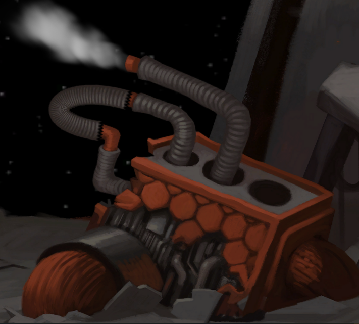

You would need the long hose hanging there. Just climbing up there and cutting it would result you falling from too high.

# So?
Cut it where you _can_ reach. Use the knife ^[Knife can be found where you started. Talk to it.] while standing next to the pipe and you get a smaller pipe.

# Then what?
Use the small tube to combine the pipes in the halved machine parts. The computer will tell you what happens when you try the combinations.

# Hmm.. panels...
Yes, you can open up three panels by connecting the pipes.

# So what?
One of the panels would probably catch you if you fall from the top.

# Which of them?
The panel 36. You get it by connecting the hose to the two bottom pipes in the right half.

# The panel is out
Now, just climb up the hose and cut it with the knife. The panel will catch you.
