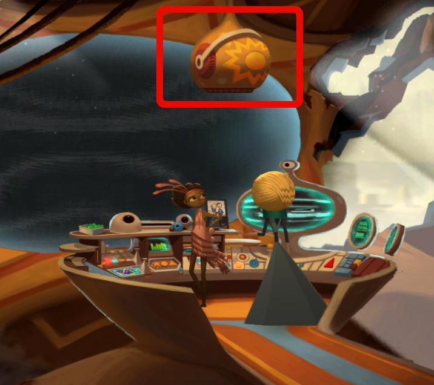

You need to get out of the control room. Marekai has locked you in.

# How to get out?
Did you try the control sphere?

# What's that?

# Oh that! Yes, I don't know what to do.
The little locks will lock and unlock doors, the hexagons control the peripherals and the claw marker will control the claws.
Lights can be shut down for a while with the little flower looking icons.
Clicking the lightning markers cause small electric short circuits. You can move between the rooms with the arrows.

# Okay, I fiddled with them, what now?
There is the Hexi-gal in the far rightmost corridor room. If you short circuit the lightning icon near it, it will fix it.

# Cool!
Indeed. Maybe it could fix the circuit next to the control room door, too?

# Go on?
Try to lure the Hexi-gal all the way to the control room.

# How?
Every time it sees a faulty electricity it goes to fix it. By timing the clicks to the lightning icons you can lure it away and to the doors.

# It doesn't go there
It also wants to show light in dark areas. You have to take the lights out also. So, time your lightning icon clicking and the lights icon clicking so that the Hexi-gal moves all the way to the left.

# Show me!
Here is a video how to do it.

<figure class="video_container">
	<video controls="true" allowfullscreen="true">
		<source src="hexigal_timing.webm" type="video/webm" />
	</video>
</figure>

# Oh no!
No worries. Go into the kitchen.

# It is there!
Change the computer to "TACO PILL TUESDAY" and click the claw.

# It is saved
Great, now just unlock the door and click on the lightnings again to lure it next to the control room door.
