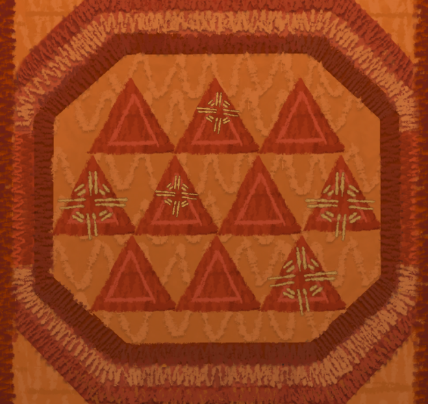

You would have to drive away before the explosion.

# With what?
Remember, the ship moves with the force of Space Weaver ^[Unlock the door using the control sphere].

# It is broken.
[Activate it first.](035-activate-space-weaver.md)

# Space weaver, activated!
Great, then just show it [a star chart](100-starchart.md).

# It doesn't go anywhere
The star chart is the same location you are at now. Remember what Shay did?

# Change the scarf?
Yes, get [a hook](110-hook.md) and make changes (any changes) to the NavScarf while Space Weaver makes the countdown.

# What is the correct pattern?
As Shay, have you talked to Alex lately? I think you might find something interesting to talk with him.

# Yes?
Especially if you offer him the [Feast Master's pitch pipe](/02-shay/04-shellmound/020-feast-master.md).

# A song?
It is a song that gets navigation computers to return to their previous destination.

# But what about NavScarf?
Well, the song has _low_, _mid_ and _high_ notes.

# Just like in the scarf!
Yes, weave the scarf to match it.
The song went like this: _mid_, _mid_, _high_, _low_, _mid_.

# Show me!
Here:

