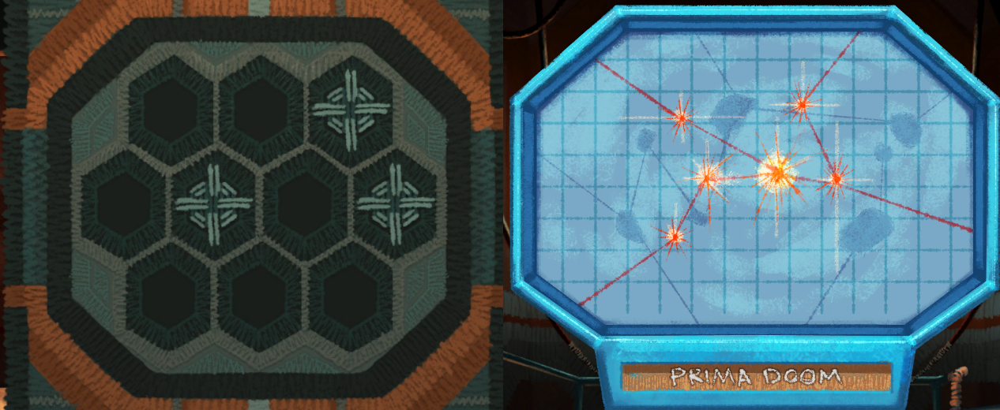
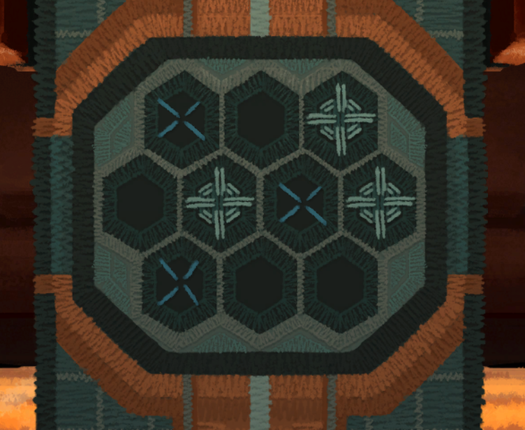

The Space Weaver will get you anywhere when you give it the Star Chart.

# Except Prima Doom!
Yes, it is dangerous. Have you noticed how the Space Weaver works?

# How?
First, you tell it where to go (for example Smile System, Puppy Planetoid, Cozy Cluster) and it weaves a NavScarf. After a _brief waiting_ the NavScarf is sucked down and the actual movement of the ship is based on what is in the NavScarf.

# Interesting
Interesting indeed. If you could, during that brief waiting time, mess with the NavScarf.

# With what?
First, you need a crochet hook. You have used one, right ^[Go check the Hug Attack room. Help the creature by talking to it]?

# I have the crochet hook
Nice. Now when you ask the Space Weaver to go somewhere you can go and add your own knittings into the pattern by using the crochet hook on NavScarf (go down the ladder).

# What is the pattern?
Look at the Prima Doom Star Chart (double click it in the inventory).

# I don't get it
Best one of the three possible destinations to add your own crochets is Cozy Cluster. Compare it to Prima Doom Star Chart.

# Help me
Ask the Space Weaver to get you to Cozy Cluster. Then using the crochet hook add following stiches.

