When you get Brother Lightbeard's cloud down the next thing is to ask F'thr to untie the bow.
Give him any _good_ reason to help you (not the fraudster one).

# Hard knot!
It is! And F'ther only makes it messier!

# We need help
That is correct. You need a knot expert!

# Who is that?
Someone who is good with her hands.

# Who is it?
Carol, go talk to Carol about the knots. You have to know what the knot looks like so try it first with F'thr. Try to describe the knot you left behind well.

# Talked with her
You need a Writing utencil... like a pen?

# A pencil?
Alex has a pencil. Go talk to him and ask for the pencil. Give it to Carol.

# A diagram!
Great, now, just go back to the ladder and shout the instructions on the diagram to F'thr.

# I can't do it
First, did you describe the knot correctly to Carol?
Use the following table to check that you have the correct description:

| Knot | Description |
|------|:-----------:|
| 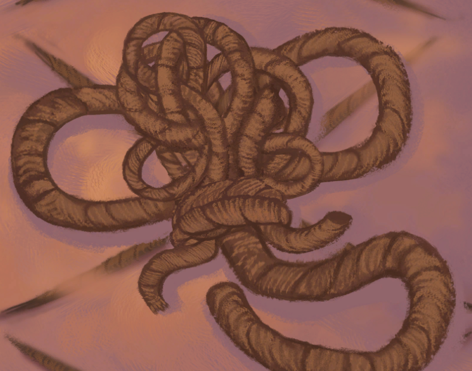 | Two snakes fighting |
| 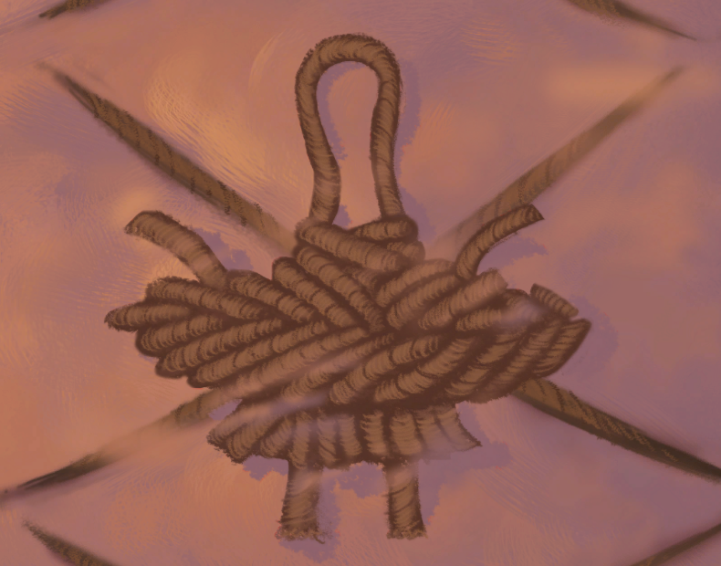 | Little bit like Carol |
| 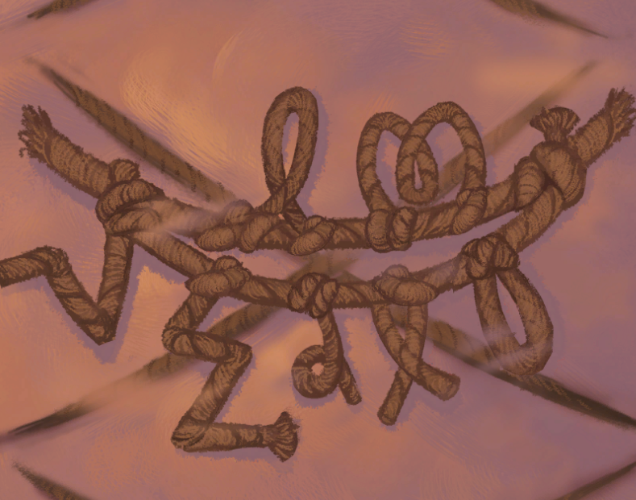 | Mathematical formula |
| 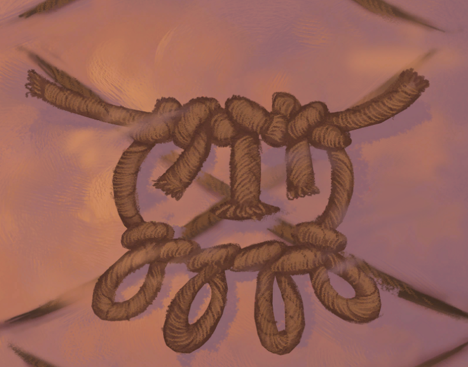 | Face like cow's udder |
| 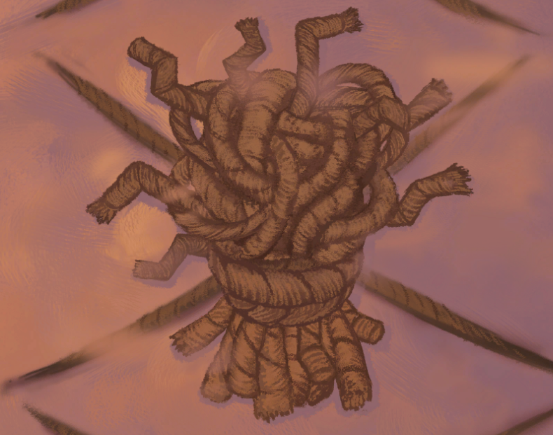 | Headache wearing a belt |
| 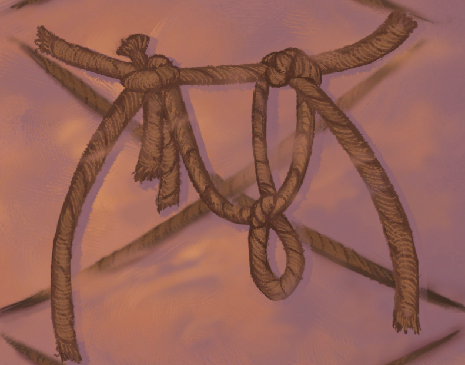 | Lazy pole vaulter |
| 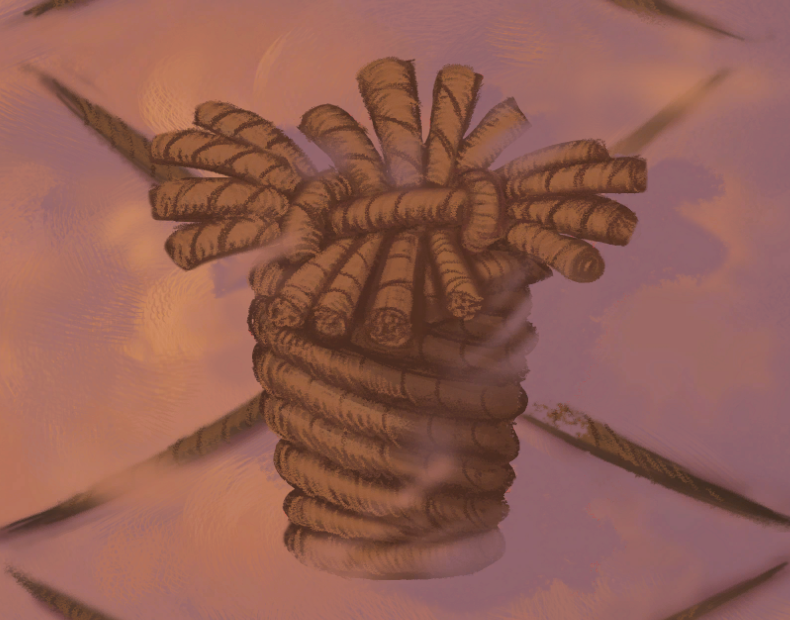 | Cup of fingers |

# I think I got that right
Good, this table will help you with the diagram:

| Diagram | Instruction |
|------|:-----------:|
| 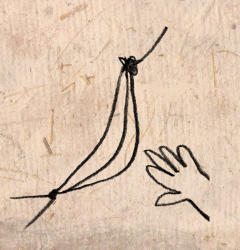 | Steal the banana |
| 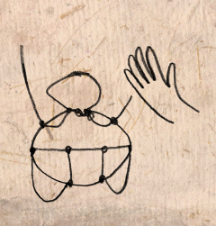 | Make the baby play patty-cake |
| 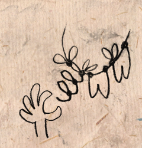 | Tug on the piggy's tail |
| 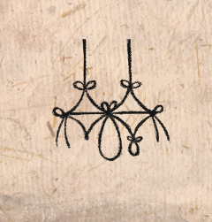 | Poke the clown in the eye |
| 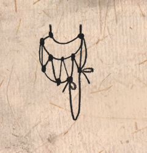 | Pull the finger |
| 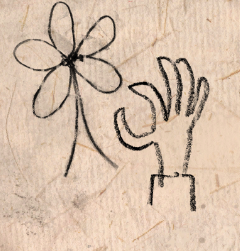 | She loves me, she loves me not... |
| 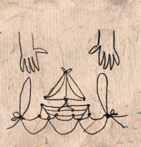 | Make the boat go under the bridge |
| 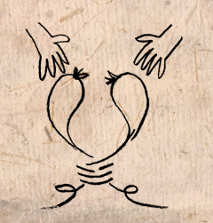 | Pull apart the fighting snakes |
| 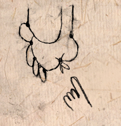 | Tickle the foot |
| 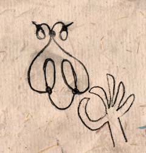 | Pull off the fly's wings |
| 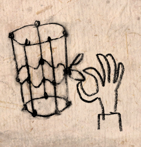 | Make the water come out of the cup |
| 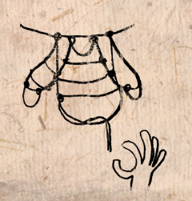 | Unravel the sweater |
