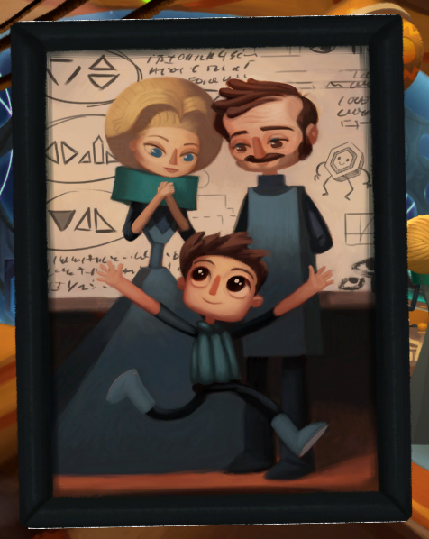
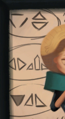

The hexipal does not work until it is wired correctly.
You have [wire](070-wire.md)?

# I have the wire
Right. Then just combine the wire with the hexipal buddy and make it alive again.

# How?
Have you tried to insert the hexipal to any diamond shaped sockets?

# Like?
Like the one in the space ship. On the left side. Stick the hexipal there.

# Doesn't look good
Wire him up some way and try again.

# It creates symbols!
Right. Now you just need to find the correct symbols.

# Any hints?
Have you played with [Vella](/01-vella/04-bossanostra/index.md)? She is now in the ship where the Hexipal buddy originated.

# I have?
Did you get Vella  [into the control room](/01-vella/04-bossanostra/03-control-room/index.md), yet?

# I have access there, yes
Look at the picture on the table.

# Interesting
Take note of the symbols on the left.
Now, just wire the hexipal so that the symbols it creates match.

# Help!
Each node will represent one of the symbols. The wiring order is also important. Try out with the blue wire first. Start from some node and connect it to other nodes. If the left blue icon is correct you have the blue starting point correct. When the right blue icon is also correct, you have the wiring done correctly with the blue wire.

# Okay
Now, just repeat changing the nodes of the wires (remember, the order matters) to get the symbols to match the picture. When you get them right, the hexapal will be awake. Give it to Alex. Here are the symbols for reference.

