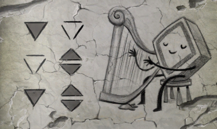

There are those ancient hexipals blocking your access to the switch.

# How to get past them
They look like a tribe or something. [Do you have your own hexipal?](025-hexipal.md)

# I have it
Show it to the tribe.

# They like it
And they follow you (or it). Now, if you could just get them to do something together.

# What?
Like, you know, play some music in the music room. With the harp.

# How?
Have you checked the book that is at the table, in the corridor.

# Yes, symbols
Right. Wiring the hexipal to those symbols would make it a harp-playing hexipal!

# Wiring
So, go upstairs and, by checking from the charging station, wire it until the symbols match to the ones in the book.
Here are the symbols for reference:

# Harp-playing hexipal
You have it? Good. Now, take it to play some harp music. The tribe will join and you can get to the power room.
